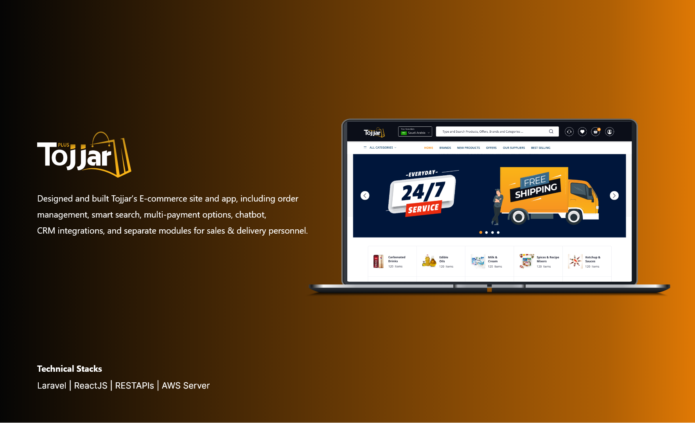
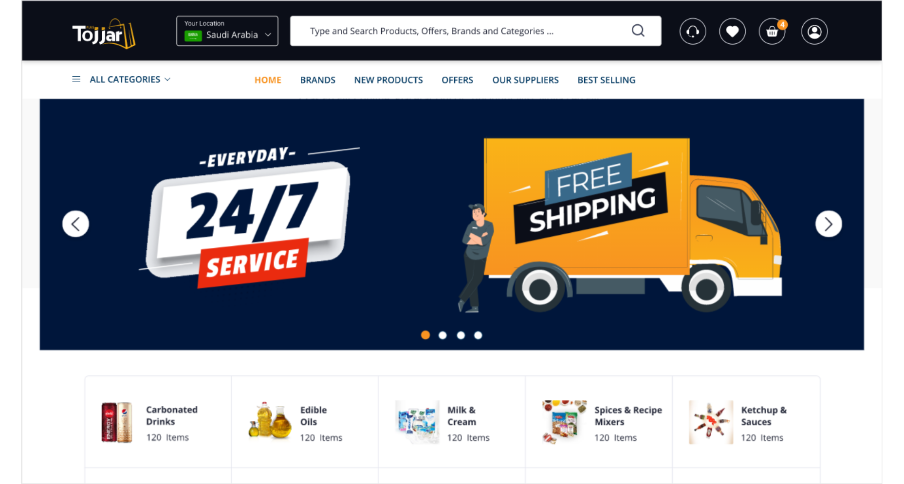
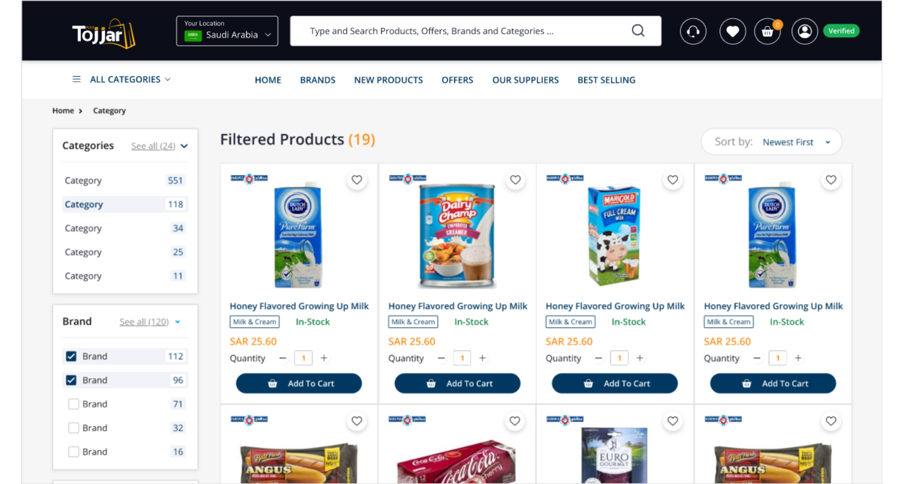
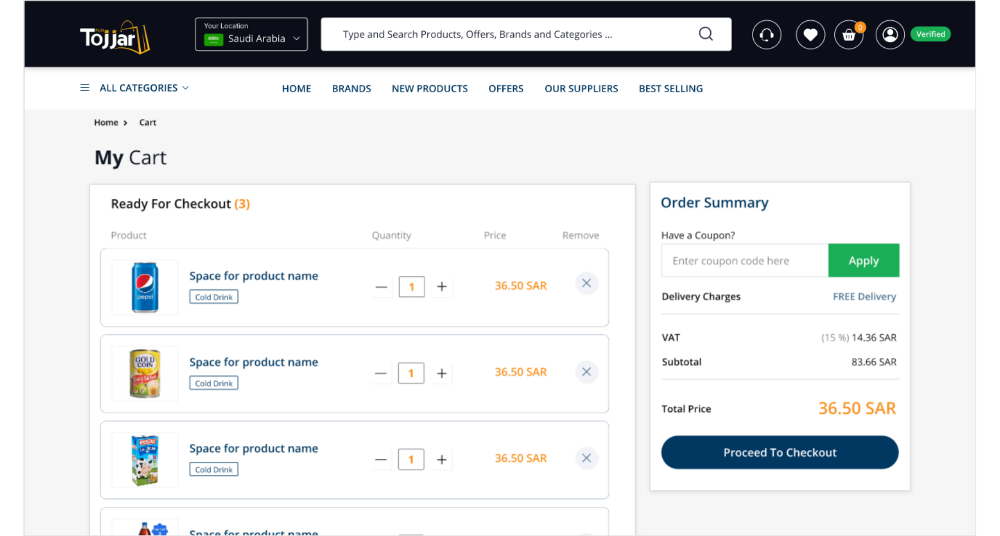
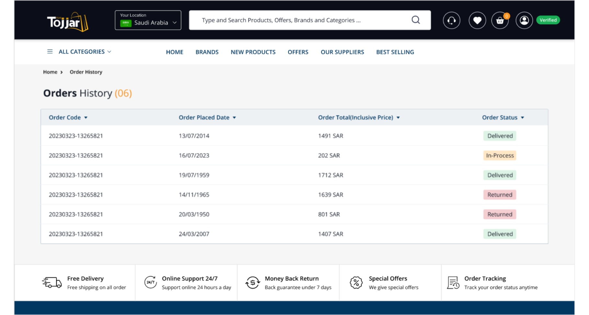
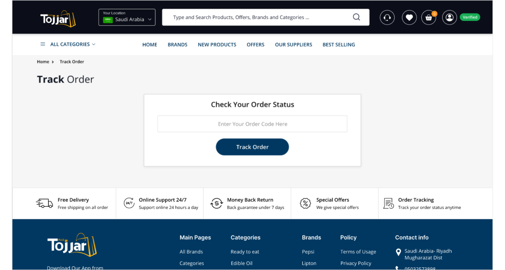

# Tojjar

INTRODUCTION

Tojjar Ecommerce Application aims to provide users with an easy and intuitive way to purchase products online and is targeted at consumers looking to buy a wide range of products across various categories. Tojjar Plus simplifies sourcing, ordering, and managing products in bulk. It's more than a platform; it's your partner in wholesale success. Tojjar has customer, admin, sales agent, and driver applications.

SYSTEM FEATURES

1. Place and manage bulk orders with ease. Our intuitive interface allows for quick order placement, tracking, and updates. Stay in control of your orders throughout the entire process.
2. Our responsive customer support team is available to assist you whenever you need help.
3. Tojjar Plus incorporates robust payment gateways, ensuring the confidentiality and safety of your payments.
4. Stay updated with real-time order tracking and notifications. Know exactly where your orders are in the fulfillment process and receive timely status updates.

TECNICALITIES/TOOLS USED

1. ASP .NET
3. ReactJS
4. RESTAPIs
5. AWS Server

SYSTEM SCREENSHOTS

 

